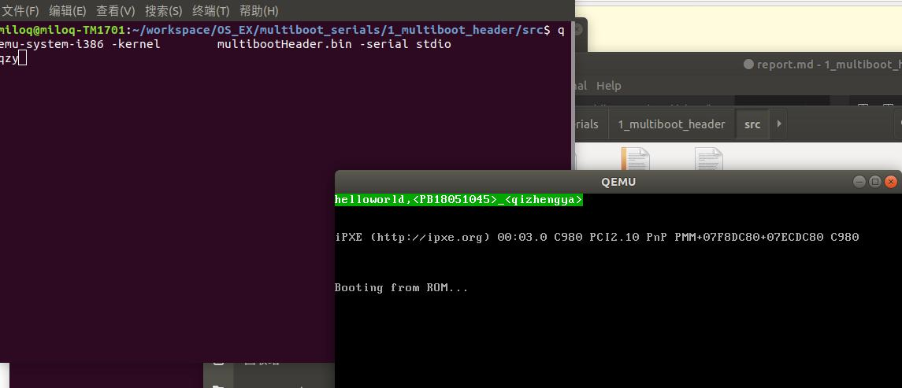

# 实验1multiboot启动报告

##  原理说明
以multiboot 为启动协议，qemu作为bootloader 来启动一个小的os内核。
以及qemu对串口的支持。

## 源代码说明
实验文件总共为3个
分别是makefile   ld  和.s 文件   
makefile 作用为使.s文件编译生成.bin文件  中间使用安装gcc编译器 
ld文件是链接文件   中间写了代码格式和代码排布内存布局
.S文件里面存放汇编代码  头部留出12个字节 每个ga字符两个字节  将每个字符的字节连续存放于一片地址空间中得到最后结果

## 地址空间说明
从物理内存1M开始放置内容代码  
12个字节向后8个字符对齐
从16字节开始放置写VGA的代码

## 编译过程说明  
用gcc 把.s文件生成.o文件 用链接器把.o文件按照ld部署要求把他链接成.bin文件
clean可以把之前的删除  重新make可以生成新的.o.bin文件

##  运行和运行结果说明
运行命令为
qemu-system-i386 -kernel        multibootHeader.bin -serial stdio

可以看到截图内成功在qemu界面和命令行输出了 学号姓名和名字的缩写。实现了VGA输出和命令行输出。
