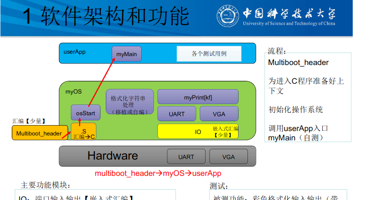
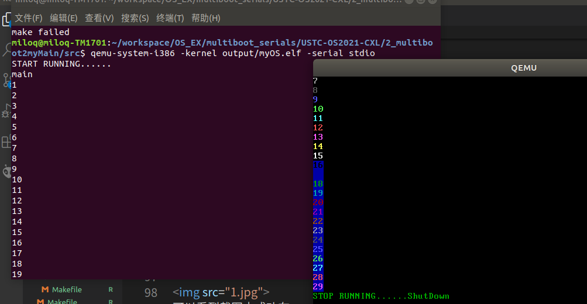

# 实验2 multibootmymain 报告

##   操作系统框图 


如图为整个软件的框架图   
我们的操作系统实现的功能就是为用户提供myprintf函数来让用户调用从而实现VGA输出和uart输出


##  主流程和实现
1. qemu 用multiboot_header 启动协议启动
2. multiboot_header中的代码 使跳到start32.S文件   start32.S文件准备好汇编进入c语言的配置之后  call osStart 
从而进入osStart.c文件
3. osStart.c 就调用myos（我们自己写的操作系统）的myprintf/k函数来实现userAPp的功能。


##  主要功能模块及其实现
### 串口功能
串口功能首先实现 inb,outb函数
然后uart_putchar 调用  outb函数来实现
uart_putchars 又调用 uart_putchar 函数来实现

### vga输出功能
1. vga 首先要实现读取和设置光标的位置功能
从而能知道后续putchar的位置
2. 然后是滚屏的实现。
3. 然后具体实现putchar
4. 借助对全屏幕putchar无色空格来实现 clean_screen功能
5.  借助putchar实现apeend2screen功能


## 源代码说明

```
void ScrollUp() {  //实现滚屏一行
    for(int line = 0 ;line<buffer_height;line++)
        for(int  i = 0 ;i<buffer_width*2;i++)
            *(VGABASE+line*buffer_width*2+i) = *(VGABASE+(line+1)*buffer_width*2+i);
    
    cursor_y = 24;   
}
```
滚屏把每一行的数据替换成下一行即可，最后设置光标为最后一行的开始处即可


```
void putchar(unsigned char c,int color){
    switch(c){
        case '\r':
        case '\n':
                cursor_x = 0;
                cursor_y++;
                break;
        case '\t':
                cursor_x+=4;
                if(cursor_x>=buffer_width){
                    cursor_x -= buffer_width;
                    cursor_y++;
                }
                break;
            default:
            {
                int pos =  cursor_y*buffer_width + cursor_x;
                *(VGABASE+pos*2) = c;   
                *(VGABASE+pos*2+1) = color;
                pos++;
                cursor_x = pos%buffer_width;
                cursor_y = pos/buffer_width;

            }
            break;

    }
    if(cursor_y == buffer_height)   ScrollUp();
    set_cursor(cursor_x,cursor_y);

}
```
vga putchar主要是对不同的字符来判别不同的光标位置，最后在光标位置处放置字符和color，放置之后，pos++。

## 地址空间说明
在1M位置处放置multiboot_header启动代码
然后放置代码段
然后放置数据段
接着放置bss段


## 编译过程说明  
用gcc 把.s文件生成.o文件 用链接器把.o文件按照ld部署要求把他链接成.bin文件
clean可以把之前的删除  重新make可以生成新的.o.bin文件

##  运行和运行结果说明

<br>     
如图可以看出实现了串口和vga的滚屏输出


